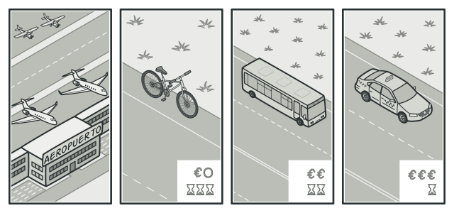
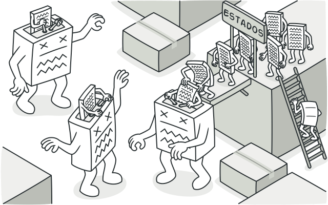
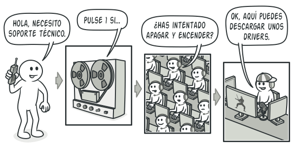

# Patrones de Diseño de Comportamiento (Behavioral Patterns)

Este documento sirve como un resumen y una guía de referencia rápida para los patrones de diseño de comportamiento implementados en este proyecto.

---

## 1. ¿Qué son los Patrones de Comportamiento?

Los patrones de comportamiento se centran en los **algoritmos y la asignación de responsabilidades entre objetos**. No describen solo patrones de objetos o clases, sino también los patrones de comunicación entre ellos. Estos patrones aumentan la flexibilidad en la forma en que los objetos se comunican y colaboran.

---

## 2. Resumen de Patrones

A continuación se detalla el propósito y el caso de uso de cada patrón de comportamiento.

---

### Strategy (Estrategia)

- **Propósito**: Encapsula una familia de algoritmos y los hace intercambiables, permitiendo que el algoritmo varíe independientemente de los clientes que lo utilizan.
- **Cuándo Usarlo**:
    - Cuando tienes múltiples variantes de un algoritmo y quieres que el cliente elija una en tiempo de ejecución.
    - Para eliminar condicionales complejos (`if/elif/else`) que seleccionan un comportamiento.
- **Ventajas**: Permite intercambiar algoritmos en tiempo de ejecución. Aísla la lógica del algoritmo (SRP). Facilita la introducción de nuevas estrategias (OCP).
- **Desventajas**: Aumenta el número de clases si solo tienes unos pocos algoritmos que no cambian.
- **Analogia en el mundo real**: Imagina que tienes que llegar al aeropuerto. Puedes tomar el autobús, pedir un taxi o ir en bicicleta. Éstas son tus estrategias de transporte. Puedes elegir una de las estrategias, dependiendo de factores como el presupuesto o los límites de tiempo.

    
    
    _Varias estrategias para llegar al aeropuerto_
---

### State (Estado)

- **Propósito**: Permite a un objeto alterar su comportamiento cuando su estado interno cambia. El objeto parecerá cambiar su clase.
- **Cuándo Usarlo**:
    - Para modelar máquinas de estado o flujos de trabajo complejos.
    - Cuando el comportamiento de un objeto depende de su estado y debe cambiar en tiempo de ejecución para evitar condicionales masivos.
- **Ventajas**: Organiza la lógica de estados en clases separadas (SRP). Elimina condicionales masivos. Facilita la adición de nuevos estados (OCP).
- **Desventajas**: Aumenta el número de clases, lo que puede ser excesivo para máquinas de estado simples.
- **Analogia en el mundo real**: Los botones e interruptores de tu smartphone se comportan de forma diferente dependiendo del estado actual del dispositivo:

    - Cuando el teléfono está desbloqueado, al pulsar botones se ejecutan varias funciones.
    - Cuando el teléfono está bloqueado, pulsar un botón desbloquea la pantalla.
    - Cuando la batería del teléfono está baja, pulsar un botón muestra la pantalla de carga.

---

### Mediator (Mediador)

- **Propósito**: Centraliza la comunicación compleja entre un grupo de objetos en un único mediador, reduciendo las dependencias directas entre ellos.
- **Cuándo Usarlo**:
    - Para desacoplar un conjunto de objetos que se comunican de forma caótica ("malla de araña").
    - Cuando es difícil reutilizar un objeto porque depende de muchos otros.
- **Ventajas**: Reduce el acoplamiento entre componentes. Centraliza la lógica de interacción, simplificando el mantenimiento.
- **Desventajas**: El mediador puede convertirse en un "God Object" monolítico y complejo si no se diseña con cuidado.
- **Analogia en el mundo real**: Los pilotos de los aviones que llegan o salen del área de control del aeropuerto no se comunican directamente entre sí. En lugar de eso, hablan con un controlador de tráfico aéreo, que está sentado en una torre alta cerca de la pista de aterrizaje. Sin el controlador de tráfico aéreo, los pilotos tendrían que ser conscientes de todos los aviones en las proximidades del aeropuerto y discutir las prioridades de aterrizaje con un comité de decenas de otros pilotos. Probablemente, esto provocaría que las estadísticas de accidentes aéreos se dispararan.

    La torre no necesita controlar el vuelo completo. Sólo existe para imponer límites en el área de la terminal porque el número de actores implicados puede resultar difícil de gestionar para un piloto.

    

    _Los pilotos de aviones no hablan directamente entre sí para decidir quién es el siguiente en aterrizar su avión. Todas las comunicaciones pasan por la torre de control._

---

### Command (Comando)

- **Propósito**: Encapsula una solicitud o una operación en un objeto independiente.
- **Cuándo Usarlo**:
    - Para implementar operaciones deshacibles (undo/redo).
    - Para poner operaciones en cola, registrarlas o ejecutarlas de forma remota.
    - Para desacoplar el objeto que invoca una operación del que sabe cómo realizarla.
- **Ventajas**: Desacopla el invocador del receptor. Facilita la implementación de colas y operaciones de undo/redo. Permite componer comandos complejos.
- **Desventajas**: Aumenta el número de clases, ya que cada acción requiere una nueva clase de comando.
- **Analogia en el mundo real**: Tras un largo paseo por la ciudad, entras en un buen restaurante y te sientas a una mesa junto a la ventana. Un amable camarero se acerca y toma tu pedido rápidamente, apuntándolo en un papel. El camarero se va a la cocina y pega el pedido a la pared. Al cabo de un rato, el pedido llega al chef, que lo lee y prepara la comida. El cocinero coloca la comida en una bandeja junto al pedido. El camarero descubre la bandeja, comprueba el pedido para asegurarse de que todo está como lo querías, y lo lleva todo a tu mesa.

    El pedido en papel hace la función de un comando. Permanece en una cola hasta que el chef está listo para servirlo. Este pedido contiene toda la información relevante necesaria para preparar la comida. Permite al chef empezar a cocinar de inmediato, en lugar de tener que correr de un lado a otro aclarando los detalles del pedido directamente contigo.

    

    _Realizando un pedido en un restaurante._

---

### Observer (Observador)

- **Propósito**: Define una dependencia uno-a-muchos entre objetos. Cuando un objeto (sujeto) cambia de estado, todos sus dependientes (observadores) son notificados y actualizados automáticamente.
- **Cuándo Usarlo**:
    - Cuando cambios en un objeto requieren que otros objetos cambien, pero no quieres un acoplamiento directo.
    - Ideal para sistemas de eventos, notificaciones (UI, apps) y seguimiento de estado.
- **Ventajas**: Desacoplamiento total entre el sujeto y los observadores. Permite añadir o quitar observadores dinámicamente (OCP).
- **Desventajas**: El orden de notificación no está garantizado. Puede llevar a actualizaciones en cascada complejas y difíciles de depurar.
- **Analogia en el mundo real**: Si te suscribes a un periódico o una revista, ya no necesitarás ir a la tienda a comprobar si el siguiente número está disponible. En lugar de eso, el notificador envía nuevos números directamente a tu buzón justo después de la publicación, o incluso antes.

    El notificador mantiene una lista de suscriptores y sabe qué revistas les interesan. Los suscriptores pueden abandonar la lista en cualquier momento si quieren que el notificador deje de enviarles nuevos números.

    

    _Suscripciones a revistas y periódicos._

---

### Chain of Responsibility (Cadena de Responsabilidad)

- **Propósito**: Pasa una solicitud a través de una cadena de manejadores. Cada manejador decide si procesa la solicitud o la pasa al siguiente en la cadena.
- **Cuándo Usarlo**:
    - Cuando más de un objeto puede manejar una solicitud y el manejador no se conoce a priori.
    - Para desacoplar al emisor de la solicitud de sus receptores. Ideal para middlewares, filtros o sistemas de aprobación.
- **Ventajas**: Desacopla al emisor de los receptores. Ofrece gran flexibilidad para añadir o reordenar los manejadores en la cadena.
- **Desventajas**: No se garantiza que una solicitud sea manejada. Puede ser difícil de depurar si la cadena es larga.
- **Analogia en el mundo real**: Acabas de comprar e instalar una nueva pieza de hardware en tu computadora. Como eres un fanático de la informática, la computadora tiene varios sistemas operativos instalados. Intentas arrancarlos todos para ver si soportan el hardware. Windows detecta y habilita el hardware automáticamente. Sin embargo, tu querido Linux se niega a funcionar con el nuevo hardware. Ligeramente esperanzado, decides llamar al número de teléfono de soporte técnico escrito en la caja.

    Lo primero que oyes es la voz robótica del contestador automático. Te sugiere nueve soluciones populares a varios problemas, pero ninguna de ellas es relevante a tu caso. Después de un rato, el robot te conecta con un operador humano.

    Por desgracia, el operador tampoco consigue sugerirte nada específico. Se dedica a recitar largos pasajes del manual, negándose a escuchar tus comentarios. Cuando escuchas por enésima vez la frase “¿has intentado apagar y encender la computadora?”, exiges que te pasen con un ingeniero de verdad.

    Por fin, el operador pasa tu llamada a unos de los ingenieros, que probablemente ansiaba una conversación humana desde hacía tiempo, sentado en la solitaria sala del servidor del oscuro sótano de un edificio de oficinas. El ingeniero te indica dónde descargar los drivers adecuados para tu nuevo hardware y cómo instalarlos en Linux. Por fin, ¡la solución! Acabas la llamada dando saltos de alegría.

    

    _Una llamada al soporte técnico puede pasar por muchos operadores._

---

## 3. Tabla Comparativa Rápida

| Patrón | Intención Principal | Foco | Analogía |
| :--- | :--- | :--- | :--- |
| **Strategy** | Encapsular algoritmos intercambiables. | Cómo un objeto realiza una tarea. | Elegir una ruta en un mapa (coche, bici, a pie). |
| **State** | Cambiar el comportamiento de un objeto según su estado. | Qué puede hacer un objeto en su estado actual. | Los botones de un reproductor de música (Play/Pause). |
| **Mediator** | Centralizar la comunicación entre objetos. | Cómo colabora un grupo de objetos. | Torre de control de un aeropuerto. |
| **Command** | Encapsular una acción en un objeto. | Convertir una operación en un objeto portable. | Un pedido en un restaurante. |
| **Observer** | Notificar a múltiples objetos sobre un cambio. | Mantener a los objetos sincronizados. | Suscripción a un canal de YouTube. |
| **Chain of Responsibility** | Pasar una solicitud por una cadena de posibles manejadores. | Desacoplar quién envía de quién recibe. | Línea de soporte técnico con varios niveles. |
---