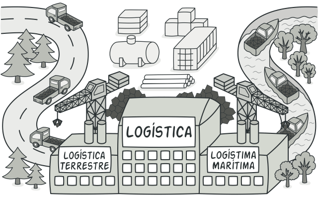
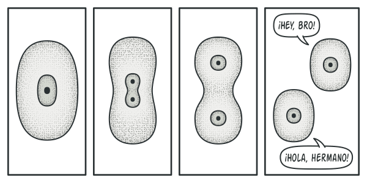

# Patrones de Diseño Creacionales

Este documento ofrece un resumen y una comparación de los patrones de diseño creacionales, explicando cómo se encargan de la creación de objetos de una manera que aumenta la flexibilidad y la reutilización del código.

---

## 1. ¿Qué son los Patrones Creacionales?

Los **patrones creacionales** proporcionan mecanismos para la creación de objetos. Su objetivo principal es abstraer el proceso de instanciación, de modo que el sistema sea independiente de cómo se crean, componen y representan sus objetos. Esto conduce a un código más flexible y menos acoplado.

---

## 2. Resumen de Patrones Creacionales

A continuación se detalla el propósito y el caso de uso de cada patrón creacional.

---

### Factory Method (Método de Fábrica)

- **Propósito**: Define una interfaz para crear un objeto, pero deja que las subclases decidan qué clase concreta instanciar.
- **Cuándo Usarlo**: Cuando una clase no puede anticipar la clase de los objetos que necesita crear y quieres que las subclases especifiquen qué crear.
- **Ventajas**: Desacopla el código cliente de las clases concretas del producto. Permite introducir nuevos productos sin cambiar el cliente (OCP).
- **Desventajas**: Requiere crear una jerarquía de creadores paralela a la de productos, lo que aumenta el número de clases.

---

### Abstract Factory (Fábrica Abstracta)

- **Propósito**: Proporciona una interfaz para crear familias de objetos relacionados o dependientes sin especificar sus clases concretas.
- **Cuándo Usarlo**: Cuando tu sistema debe ser independiente de cómo se crean sus productos y necesitas trabajar con múltiples familias de objetos que deben ser consistentes entre sí.
- **Ventajas**: Aísla las clases concretas. Garantiza la compatibilidad entre los productos de una familia. Facilita el intercambio de familias de productos.
- **Desventajas**: Es difícil añadir nuevos tipos de productos, ya que requiere modificar la fábrica abstracta y todas sus subclases.    

---

### Builder (Constructor)

- **Propósito**: Separa la construcción de un objeto complejo de su representación final, permitiendo que el mismo proceso de construcción cree diferentes representaciones.
- **Cuándo Usarlo**: Cuando el proceso de creación de un objeto es complejo, con muchos pasos o parámetros de configuración opcionales.
- **Ventajas**: Permite variar la representación interna del producto. Aísla el código de construcción. Proporciona un control más detallado sobre el proceso de creación.
- **Desventajas**: Requiere crear un `Builder` para cada tipo de producto, lo que aumenta el número de clases.

---

### Prototype (Prototipo)

- **Propósito**: Permite crear nuevos objetos copiando una instancia existente (un prototipo).
- **Cuándo Usarlo**: Cuando el coste de crear un objeto desde cero es alto o cuando quieres evitar una jerarquía de fábricas paralela a la de productos.
- **Ventajas**: Permite añadir y eliminar productos en tiempo de ejecución. Evita la herencia de creadores. Puede mejorar el rendimiento al clonar objetos pre-configurados.
- **Desventajas**: Clonar objetos complejos con referencias circulares puede ser complicado.
- **Analogia en el mundo real**:Ya que los prototipos industriales en realidad no se copian a sí mismos, una analogía más precisa del patrón es el proceso de la división mitótica de una célula (biología, ¿recuerdas?). Tras la división mitótica, se forma un par de células idénticas. La célula original actúa como prototipo y asume un papel activo en la creación de la copia.

    

    _La división de una célula._

---

### Singleton

- **Propósito**: Garantiza que una clase tenga una única instancia y proporciona un punto de acceso global a ella.
- **Cuándo Usarlo**: Para gestionar el acceso a un recurso compartido y único, como una conexión a base de datos, un gestor de logs o un objeto de configuración.
- **Ventajas**: Instancia única garantizada. Acceso global. Inicialización diferida (lazy initialization).
- **Desventajas**: Viola el Principio de Responsabilidad Única. Oculta dependencias. Dificulta las pruebas unitarias. Puede causar problemas en entornos multihilo si no se implementa con cuidado.
- **Analogia en el mundo real**: El gobierno es un ejemplo excelente del patrón Singleton. Un país sólo puede tener un gobierno oficial. Independientemente de las identidades personales de los individuos que forman el gobierno, el título “Gobierno de X” es un punto de acceso global que identifica al grupo de personas a cargo.

---

## 3. Tabla Comparativa Rápida

| Patrón | Intención Principal | Foco | Analogía |
| :--- | :--- | :--- | :--- |
| **Factory Method** | Crear un objeto delegando en subclases. | Herencia para la creación. | Una pizzería con sucursales (NY, Chicago) que hacen su propio estilo de pizza. |
| **Abstract Factory** | Crear familias de objetos consistentes. | Composición para crear kits. | Un kit de muebles de IKEA (silla, mesa, lámpara) de una serie específica. |
| **Builder** | Construir un objeto complejo paso a paso. | Separar construcción de representación. | Pedir un sándwich personalizado en Subway. |
| **Prototype** | Crear un objeto clonando otro. | Composición y clonación. | Una máquina de fotocopias. |
| **Singleton** | Garantizar una única instancia global. | Controlar el ciclo de vida y el acceso. | El gobierno de un país. |