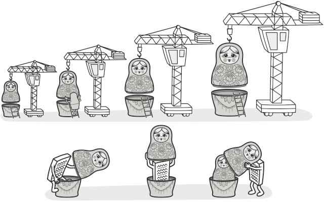

s# Patrones de Diseño Estructurales

Este documento ofrece un resumen y una comparación de los patrones de diseño estructurales, explicando cómo ensamblan objetos y clases en estructuras más grandes, manteniendo al mismo tiempo estas estructuras flexibles y eficientes.

---

## ¿Qué son los Patrones Estructurales?

Los **patrones estructurales** se centran en cómo las clases y los objetos se componen para formar estructuras más grandes. Simplifican el diseño identificando formas sencillas de realizar relaciones entre entidades. Mientras que los patrones creacionales se ocupan de la *creación* de objetos, los estructurales se ocupan de su *composición*.

**Ventaja principal:** Ayudan a garantizar que cuando una parte de un sistema cambia, el sistema entero no necesita hacerlo. Promueven la flexibilidad y la eficiencia en la arquitectura del software.

A continuación, se resumen los patrones estructurales cubiertos en este proyecto.

---

## 2. Resumen de Patrones Estructurales

---

### Adapter (Adaptador)

- **Propósito**: Permite que interfaces incompatibles trabajen juntas.
- **Cuándo Usarlo**: Para integrar una clase existente (legado, terceros) cuya interfaz no coincide con la que el cliente espera, sin modificar el código fuente original.
- **Ventajas**: Separa la lógica de conversión (SRP). Permite introducir nuevos adaptadores sin cambiar el cliente (OCP).
- **Desventajas**: Aumenta la complejidad al introducir una nueva clase.
- **Analogia en la vida real**: Cuando viajas de Europa a Estados Unidos por primera vez, puede ser que te lleves una sorpresa cuanto intentes cargar tu computadora portátil. Los tipos de enchufe son diferentes en cada país, por lo que un enchufe español no sirve en Estados Unidos. El problema puede solucionarse utilizando un adaptador que incluya el enchufe americano y el europeo.

    

    _Una maleta antes y después de un viaje al extranjero._

---

### Bridge (Puente)

- **Propósito**: Desacopla una abstracción de su implementación para que ambas puedan evolucionar de forma independiente.
- **Cuándo Usarlo**: Para evitar una "explosión de clases" cuando se tienen múltiples dimensiones de variación (ej. formas y motores de renderizado).
- **Ventajas**: Flexibilidad y extensibilidad al separar jerarquías. Desacoplamiento fuerte. Lógica de alto y bajo nivel separada (SRP).
- **Desventajas**: Aumenta la complejidad del código al introducir más clases e interfaces.

---

### Composite (Compuesto)

- **Propósito**: Permite componer objetos en estructuras de árbol y luego tratar a los objetos individuales y a las composiciones de manera uniforme.
- **Cuándo Usarlo**: Cuando se tiene una jerarquía de parte-todo (ej. sistema de archivos, menús gráficos) y se quiere que el cliente trate a todos los objetos de la misma manera.
- **Ventajas**: Simplifica el código cliente, que no necesita diferenciar entre objetos simples y compuestos. Facilita la adición de nuevos tipos de componentes (OCP).
- **Desventajas**: Puede ser difícil restringir los tipos de componentes que se pueden añadir a un compuesto. El diseño puede volverse demasiado general.
- **Analogia en la vida real**: Los ejércitos de la mayoría de países se estructuran como jerarquías. Un ejército está formado por varias divisiones; una división es un grupo de brigadas y una brigada está formada por pelotones, que pueden dividirse en escuadrones. Por último, un escuadrón es un pequeño grupo de soldados reales. Las órdenes se dan en la parte superior de la jerarquía y se pasan hacia abajo por cada nivel hasta que todos los soldados saben lo que hay que hacer.

    

    _Un ejemplo de estructura militar._

---

### Decorator (Decorador)

- **Propósito**: Añade nuevas funcionalidades a un objeto dinámicamente, envolviéndolo en objetos decoradores que comparten la misma interfaz.
- **Cuándo Usarlo**: Para extender el comportamiento de un objeto sin usar la herencia, especialmente cuando se necesitan múltiples combinaciones de funcionalidades.
- **Ventajas**: Gran flexibilidad para añadir responsabilidades. Evita la explosión de subclases. Permite añadir o quitar funcionalidades en tiempo de ejecución.
- **Desventajas**: Puede crear una gran cantidad de objetos pequeños. Puede ser complicado eliminar un decorador específico de la pila de envoltorios.
- **Analogia en la vida real**: Vestir ropa es un ejemplo del uso de decoradores. Cuando tienes frío, te cubres con un suéter. Si sigues teniendo frío a pesar del suéter, puedes ponerte una chaqueta encima. Si está lloviendo, puedes ponerte un impermeable. Todas estas prendas “extienden” tu comportamiento básico pero no son parte de ti, y puedes quitarte fácilmente cualquier prenda cuando lo desees.

    

    _Obtienes un efecto combinado vistiendo varias prendas de ropa._

---

### Facade (Fachada)

- **Propósito**: Proporciona una interfaz simplificada y unificada para un subsistema complejo.
- **Cuándo Usarlo**: Para reducir la complejidad y desacoplar al cliente de los detalles internos de un conjunto de clases (ej. una librería, un framework).
- **Ventajas**: Aísla al cliente de la complejidad del subsistema. Promueve el bajo acoplamiento.
- **Desventajas**: La fachada puede convertirse en un "God Object" si asume demasiadas responsabilidades.
- **Analogia en la vida real**: Cuando llamas a una tienda para hacer un pedido por teléfono, un operador es tu fachada a todos los servicios y departamentos de la tienda. El operador te proporciona una sencilla interfaz de voz al sistema de pedidos, pasarelas de pago y varios servicios de entrega.

    

    _Haciendo pedidos por teléfono._

---

### Flyweight (Peso Ligero)

- **Propósito**: Minimiza el uso de memoria al compartir la mayor cantidad de datos posible con otros objetos similares, separando el estado intrínseco (compartido) del extrínseco (único).
- **Cuándo Usarlo**: Cuando se necesita una cantidad masiva de objetos que tienen estados parcialmente duplicados (ej. partículas en un juego, caracteres en un editor).
- **Ventajas**: Ahorro significativo de memoria RAM.
- **Desventajas**: Aumenta la complejidad del código al tener que gestionar el estado extrínseco fuera del objeto.

---

### Proxy

- **Propósito**: Proporciona un sustituto o intermediario para otro objeto con el fin de controlar el acceso a este.
- **Cuándo Usarlo**: Para implementar inicialización diferida (virtual proxy), control de acceso (protection proxy), caching (smart proxy) o para representar un objeto remoto.
- **Ventajas**: Permite ejecutar tareas antes o después de la solicitud al objeto real. Mejora el rendimiento y la seguridad.
- **Desventajas**: Puede introducir un pequeño retardo debido a la indirección. Aumenta el número de clases.
- **Analogia en la vida real**: Una tarjeta de crédito es un proxy de una cuenta bancaria, que, a su vez, es un proxy de un manojo de billetes. Ambos implementan la misma interfaz, por lo que pueden utilizarse para realizar un pago. El consumidor se siente genial porque no necesita llevar un montón de efectivo encima. El dueño de la tienda también está contento porque los ingresos de la transacción se añaden electrónicamente a la cuenta bancaria de la tienda sin el riesgo de perder el depósito o sufrir un robo de camino al banco.

    

    _Las tarjetas de crédito pueden utilizarse para realizar pagos tanto como el efectivo._

---

## 3. Tabla Comparativa Rápida

| Patrón | Intención Principal | Foco | Analogía |
| :--- | :--- | :--- | :--- |
| **Adapter** | Convertir una interfaz en otra. | Hacer que dos cosas incompatibles funcionen juntas. | Traductor de idiomas. |
| **Bridge** | Desacoplar abstracción de implementación. | Dividir una jerarquía monolítica en dos independientes. | Interruptor de luz y aparato eléctrico. |
| **Composite** | Tratar a un grupo de objetos como a uno solo. | Construir jerarquías de parte-todo. | Ejército (soldados y divisiones). |
| **Decorator** | Añadir comportamiento a un objeto. | Envolver un objeto para darle nuevas "capas" de funcionalidad. | Ponerse ropa (chaqueta, bufanda). |
| **Facade** | Simplificar la interfaz de un subsistema. | Ocultar la complejidad interna. | Conserje de hotel. |
| **Flyweight** | Ahorrar memoria compartiendo estado. | Optimizar el uso de recursos para un gran número de objetos. | Caracteres en un editor de texto. |
| **Proxy** | Controlar el acceso a un objeto. | Actuar como un intermediario con poder. | Tarjeta de crédito. |
